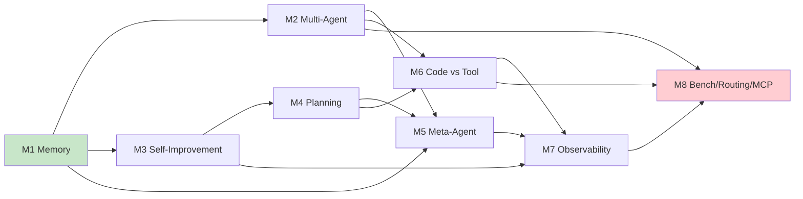

# 學習路徑

> 不知道從哪開始？8 個 M 主題**互相依賴** — 這頁告訴你建議的學習順序跟依賴關係。

## 主題依賴圖

| 顏色 | 含義 |
|------|------|
| 🟢 **綠** | 起點：必讀 |
| 🟡 黃 | 中段：建議讀 |
| 🔴 **紅** | 終點：理解 production-grade 必要 |

## 推薦學習路徑

### 🟢 起點（M1 必讀）

**M1 Memory + Context** 是所有主題的基礎 — 因為每個 agent 系統都涉及「怎麼記得」。
不讀 M1 直接看 M2/M5/M7 會缺地基。

### 🟡 中段（依目標選）

| 你的目標 | 讀 | 為什麼 |
|---------|-----|--------|
| **理解多 agent 怎麼協作** | M2 → M4 → M6 | multi-agent → planning → execution |
| **理解 agent 怎麼變強** | M3 → M4 | self-improvement → planning |
| **理解誰監督 agent** | M5 → M7 | supervision → observability |
| **理解 production 設計** | M6 → M8 | code vs tool → security/routing |

### 🔴 終點（M8 production-grade）

M8 把所有前面的主題收束 — Benchmark（量化誰好）/ Routing（量化誰便宜）/ MCP（量化誰安全）—
是 production-grade agent 系統的**三大支柱**。

## 依身份推薦順序


**M1 → M2 → M3 → M4 → M8**
重點：跨來源匯聚的命題 + 原始 arXiv 編號
每章重點看「關鍵洞察」「跨來源匯聚」「限制與反思」



**M1 → M3 → M5 → M7 → M8**
重點：可實作的 actionable 段落 + governance + security
跳過純學術段落，直接看「給實作者的啟示」「Production 必要元件」



**M1 → M2 → M4 → M6 → M7 → M8**（依依賴圖順序）
建立 mental model 為先
每章先看「開頭」「核心命題」「結語」，其他段落慢慢消化


---

## 學習時程估計

| 主題 | 行數 | 估計時間 | 難度 |
|------|------|----------|------|
| M1 Memory | 292 行 | 30 分鐘 | 🟢 中 |
| M2 Multi-Agent | 301 行 | 35 分鐘 | 🟡 中 |
| M3 Self-Improvement | 284 行 | 30 分鐘 | 🟡 中 |
| M4 Planning | 264 行 | 30 分鐘 | 🟡 中 |
| M5 Meta-Agent | 245 行 | 25 分鐘 | 🟡 中 |
| M6 Code vs Tool | 206 行 | 20 分鐘 | 🟢 易 |
| M7 Observability | 244 行 | 25 分鐘 | 🟡 中 |
| M8 Bench/Routing/MCP | 361 行 | 40 分鐘 | 🔴 難 |

**依身份完成時間**：
- 新手（依序全讀）：約 4 小時
- 工程師（5 章）：約 2.5 小時
- 研究者（5 章）：約 3 小時
