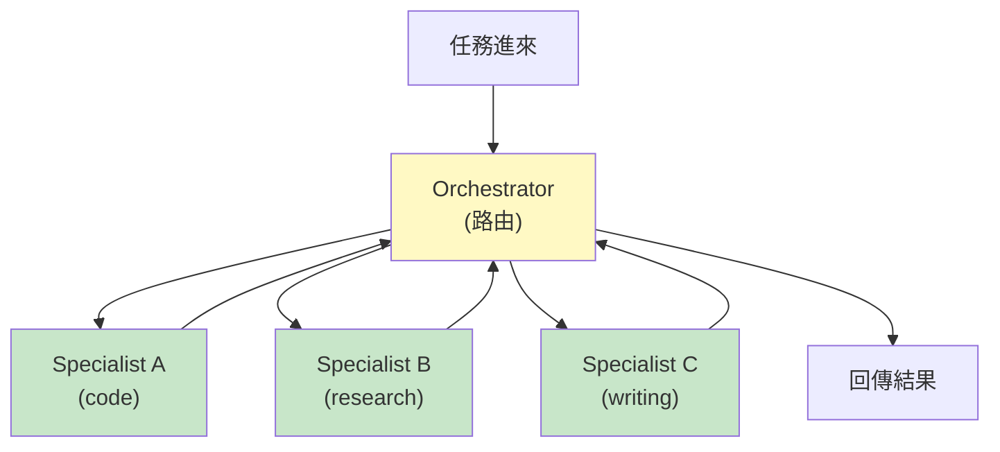
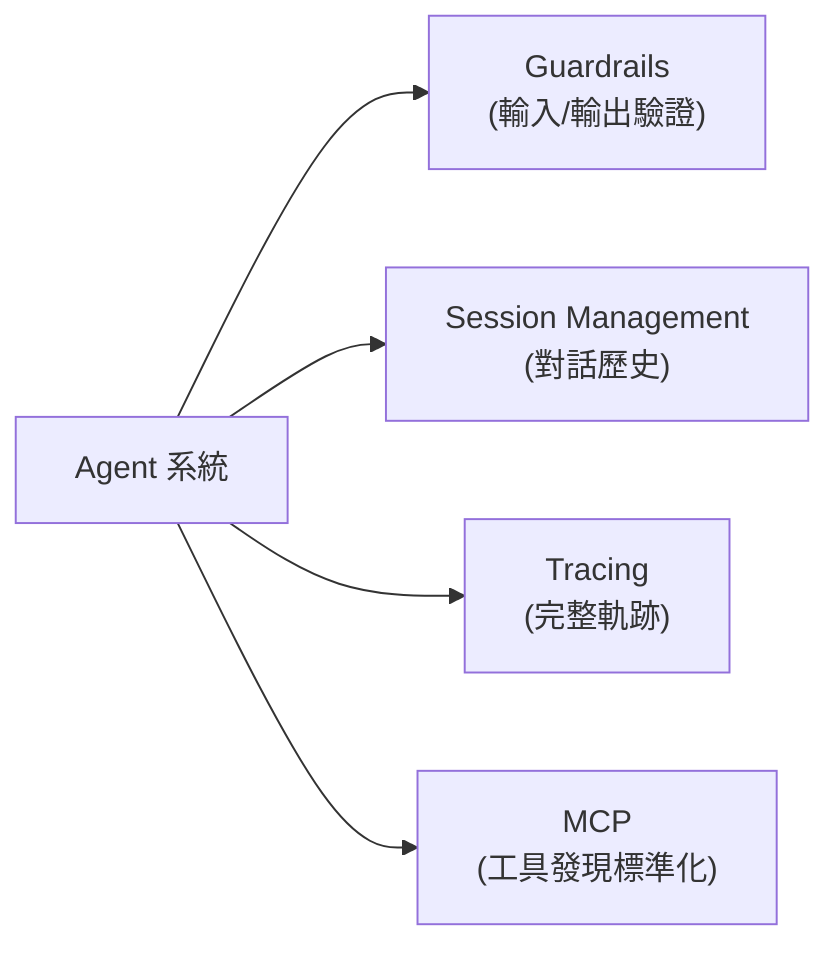
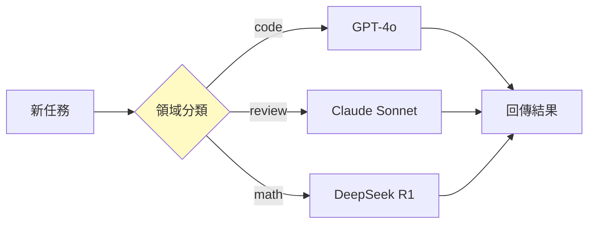

> **type="info" title="為什麼學這個？"**

>
**你在做 multi-agent 嗎？** 這章教你 5 種協調模式 + 4 個 production 必要元件。

**你在用單一 agent？** 這章幫你判斷**什麼時候**該升級到 multi-agent。
{{< /callout**

>

# M2 — 我們一群 agent 怎麼合作不打架

> 「不要強化單一 agent，要用 orchestration 架構把多個專門 agent 串起來。」
> — 2026 年業界共識

---


#### 
**開頭：為什麼我需要朋友**


單一 agent 聽起來很強 — 一個超強模型處理所有事。
但 2026 年的實戰經驗告訴我們：**這條路走不通**。

瓶頸在哪：

- **Reasoning token budget 是固定的** — 一個模型不可能同時擅長規劃、工具調用、領域知識、輸出格式化
- **就算模型更強，架構不對也沒用** — 2024-2025「GPT-5 來了就解決 agent 問題」的期待已落空
- **故障率不可忽略** — CUHK 的 MAS-Resilience 研究：agent 故障率約 **5-20%**

如果每 100 步就會錯 5-20 步，那「單一超強 agent」是個脆弱的方案。
**靠人數取勝，靠架構取勝** — 這就是 multi-agent coordination 的出發點。

---


#### 
**核心命題：不要強化單一，要 orchestration**


> 業界在 2026 年達成的共識很簡單：
> **把任務切給專門的 agent，再用協調架構把它們串起來。**



這帶來三個好處：
1. **每個 agent 簡單** — 專注一件事就好，不需要「全才」
2. **失敗局部化** — 一個 specialist 失敗不會拖垮整個系統
3. **可組合** — 換掉一個 specialist 就能升級那個能力

---


#### 
**五種協調模式**


跨 5/25 跟 6/02 兩份研究報告的整理，2026 年主流有 5 種協調模式：

| 模式 | 代表 | 適用 | 瓶頸 |
|------|------|------|------|
| **Role-Based** | ChatDev、LightAgent | 結構化任務（軟體公司模型）| 角色死板 |
| **Swarm** | AgentFlow、Swarms | 探索性、brainstorming | 共識時間瓶頸 |
| **Hierarchical** | OpenAI Agents SDK | 任務分解、並行 worker | Manager 單點失敗 |
| **Agents-as-Tools** | OpenAI Agents SDK | **2026 主流** | Sub-agent 過多時工具清單爆炸 |
| **Verify** | MMCP、CUHK MAS-Resilience | 對抗幻覺、高正確性 | Challenger 本身也可能幻覺 |

### 3.1 Agents-as-Tools — 2026 年的主流

**概念**：把 sub-agent 當成 function-calling 的工具，orchestrator 完全靠工具調用觸發其他 agent。

```python
orchestrator = Agent(
    name="orchestrator",
    tools=[
        spanish_agent.as_tool(tool_name="translate_to_spanish", ...),
        french_agent.as_tool(tool_name="translate_to_french", ...),
    ],
)
```

**進階變體**：Conditional Tool Enabling — 用 `is_enabled` 函式根據 context 動態啟/停 sub-agent，**等同於 RBAC 層級控制**。

**為什麼是主流**：
- 直接對應 LLM 已有的 function calling 能力
- 不需要新概念（不用學 message-passing）
- 容易監控（所有互動都走 function call log）

### 3.2 Hierarchical — Manager + Workers

```
Task → Manager Agent → Worker Agents (並行) → Manager aggregates
```

- Worker 不知道自己在更大的工作流中
- 只對 manager 負責
- **簡化每個 agent 決策複雜度，但增加 manager 單點失敗風險**

### 3.3 Swarm — 去中心化多輪

```
Phase 1: Task Initiation → Agent Turn (所有 agent 貢獻) → Aggregator
                         ↑________________________________|
```

每輪所有 agent 貢獻，經多輪後由 aggregator 綜合。
**適合創意發想，不適合有標準答案的任務**。

**警告**：Swarms 雖然有 57k stars，但**社群文檔品質不如 OpenAI Agents SDK / Agency Swarm**，57k stars 來自病毒效應不代表技術領先。

### 3.4 Verify Pattern — 對抗式

```
Producer → Challenger → Judge
```

三方制衡對抗單一 agent 幻覺：
- **Producer** — 生成答案
- **Challenger** — 專門找漏洞
- **Judge** — 裁決誰對

**風險**：Challenger 本身也是 LLM agent，**可能被同樣的幻覺手法欺騙**。

---


#### 
**Production 系統的 4 個必要元件**


2026 production-grade agent 系統不是「隨便串幾個 agent」 — 必須有 4 個標準配備：



### 4.1 Guardrails

**多 agent 系統中，錯誤會傳播。** 一個 worker 的幻覺輸出會汙染後續所有 agent。

```python
from agents import Agent, OutputGuardrail

guardrail = OutputGuardrail(
    name="no_profanity",
    validate_output=lambda ctx, agent, output: {
        "pass": "fuck" not in output.text.lower(),
        "failure_message": "Output contained inappropriate language",
    },
)

agent = Agent(name="support", guardrails=[guardrail])
```

### 4.2 Session Management

每個 sub-agent 可能需要**獨立的 session context**。
不能讓所有 agent 共享同一份對話歷史 — 會爆 context 也會洩漏。

### 4.3 Tracing

```python
with trace("order_processing"):
    result = await Runner.run(sales_agent, user_input)
    # 整個 run 的工具調用、LLM 決策、sub-agent handoffs 都被追蹤
```

**為什麼必要**：當 production 出事時，你需要的不是 log，是**整個決策樹的可視化**。
OpenAI 自己的 tracing UI 能視覺化完整的多 agent trace tree。

### 4.4 MCP — 工具發現的標準化

```
Client (Agent Framework)
    ├── ListTools → MCP Server → Tool List
    └── CallTool(name, args) → MCP Server → Result
```

**MCP 解決「工具發現」，不解決 orchestration**。
MCP 是 protocol-level 標準，不依賴特定模型或框架。

---


#### 
**RL 驅動的 Domain-Aware Routing**


**MMCP** 的核心創新：**學習每個模型擅長什麼領域，動態路由任務**。

| 任務 | 領域 | 模型 | 分數 |
|------|------|------|------|
| Write Python API with auth | code_generation | GPT-4o | 0.96 |
| Debug React component | code_review | Claude Sonnet | 0.91 |
| Prove calculus theorem | math_reasoning | DeepSeek R1 | 0.92 |



**重要特性**：當模型更新升級，**系統會重新 benchmark，自動更新路由策略**。

**限制**：
- RL routing 需要累積足夠 benchmark 數據，**冷啟動問題存在**
- Domain detection 準確度依賴任務描述的清晰度，**模糊任務容易選錯領域**

---


#### 
**故障韌性：5-20% 不是例外**


CUHK MAS-Resilience 的核心發現很直白：

> Agent 系統不能假設每個 agent 都正確。

- **5-20% 故障率** — agent 故障率
- 目前測試的攻擊手法（AutoTransform、AutoInject）只是冰山一角
- 防禦方法（Inspector、Challenger）**本身也是 LLM agent，可能被同樣的手法欺騙**
- 防禦 overhead 會增加延遲與成本

**現狀**：RESEARCH-ONLY，學術階段還未 production-ready。**方向值得關注，等成熟再實作**。

---


#### 
**框架選擇決策矩陣**


| 框架 | Stars | 何時用 | 何時不要用 |
|------|-------|--------|-----------|
| **OpenAI Agents SDK** | 官方 | production、需要官方文件密度 | 想擺脫 OpenAI 鎖定 |
| **Agency Swarm** | 5.4k | 需要結構化 communication_flows | OpenAI 鎖定 |
| **Swarms** | 57k | ❌ 不推薦 | 文檔品質問題 |
| **CrewAI** | — | 需要 declarative YAML | 靈活度不如 Python-first |
| **MCP-agent** | — | 需要 MCP 工具自動發現 | orchestration 仍需自己實作 |

**我的判斷**：
- Production 預設 **OpenAI Agents SDK**
- 需要 agent-to-agent 直接通訊 → **Agency Swarm**
- 千萬不要被 Swarms 57k stars 騙

---


#### 
**自我改善的缺口**


**這是 2026 H1 multi-agent 最大的盲點**：

> 所有 orchestration 框架都專注於**靜態架構** — agent 的能力在部署時就固定了，運行時只能靠外部工具（如 RAG）更新知識。**沒有任何框架內建自我改善機制**。

Orchestration 和 self-improvement 是兩個獨立的問題，目前社群傾向於分開解決。
這指向 [M3 Self-Improvement](/docs/m3-self-improvement/) 的主題（下一章）。

---


#### 
**對 Hermes 的啟示**


{{< details title="💡 給實作者的啟示（點開看 actionable 建議）"**

>
截至 2026-06-08，Hermes 的 multi-agent 能力現況：

| 缺口 | 優先 | 解法 |
|------|------|------|
| `delegate_task` 無 shared memory | 🟡 中 | 實作 shared episodic layer |
| Sub-agent 間無 file locking | 🟡 中 | 引入分散式鎖 |
| 缺少 Output Guardrails | 🔴 高 | 在 firn 輸出路徑加 validation layer |
| 沒有完整 Tracing | 🟡 中 | 短期先在日誌層面結構化 trace JSON |

---


{{< /details**

>


#### 
**結語：協作的兩個方向**


multi-agent 協作有兩個看似矛盾的方向：

- **去中心化** — agent-to-agent 直接通訊，不靠中央 orchestrator
- **中心化** — orchestrator 統一調度，sub-agent 各自簡單

2026 年的答案是：**根據任務性質選**。
- 創意、探索 → Swarm（去中心化）
- 任務分解、有標準答案 → Hierarchical（中心化）
- production、需要監控 → Agents-as-Tools（中心化但鬆耦合）

**不要追求「最好」的架構，要追求「最適合這個任務」的架構。**

---


## Q&A — 給實作者的常見問題

{{< details title="Q1: 多 agent 一定比單一 agent 好嗎？"**

>
**不一定**。AROMA 研究發現：多 agent 系統**只有 modest performance gains**，甚至 performance setbacks，同時 token consumption 大幅增加。

**判斷標準**：任務能否**清楚分解**給專門 agent？不能就別用。
{{< /details**

>

{{< details title="Q2: Agents-as-Tools 跟 Hierarchical 怎麼選？"**

>
**預設用 Agents-as-Tools**（OpenAI Agents SDK 模式）。

- 對應 LLM 已有的 function calling 能力
- 容易監控（所有互動走 function call log）
- 失敗局部化（sub-agent 失敗不拖垮 orchestrator）

Hierarchical 只在任務需要**真正的並行 worker** 時才用。
{{< /details**

>

{{< details title="Q3: 如何避免 multi-agent 的「資訊過載」？"**

>
三個手段：

1. **Output guardrails** — 驗證每個 worker 輸出（防止幻覺傳播）
2. **Shared memory schema** — 統一格式（防止格式斷裂）
3. **MCP** — 工具發現標準化（防止 tool 描述不一致）
{{< /details**

>

---

## 給實作者的 checklist

> 評估你的 **M2-MULTI-AGENT** 系統是否 production-grade：

- [ ] 有對應的設計元素實作
- [ ] 失敗模式有被識別
- [ ] 可量化的評估指標
- [ ] 跨來源的設計 pattern 驗證
- [ ] 邊界情況有處理

---

## 下一步學什麼

**M3 Self-Improvement** — 你的 multi-agent 怎麼從失敗中學習？

→ [繼續 →](/docs/m3-self-improvement/)

## 引用與延伸閱讀

{{< details title="📚 引用與延伸閱讀（點開看完整 reference）"**

>
**原始整合文**：
- [multi-agent-coordination-core-concepts.md](https://github.com/example/obsidian-vault/blob/main/research/agent/multi-agent-coordination-core-concepts.md)

**原始研究報告**：
- 2026-05-25-研究報告-multi-agent-coordination-protocols.md
- 2026-06-02-研究報告-agent-orchestration-patterns-現代多-agent-工作流架構解析.md

**相關 M 主題**：
- [M1 Memory + Context](/docs/m1-memory/) — 共享記憶怎麼運作
- [M3 Self-Improvement](/docs/m3-self-improvement/) — agent 怎麼自己變強
- [M5 Meta-Agent](/docs/m5-meta-agent/) — 誰來監督多 agent 系統

{{< /details**

>
