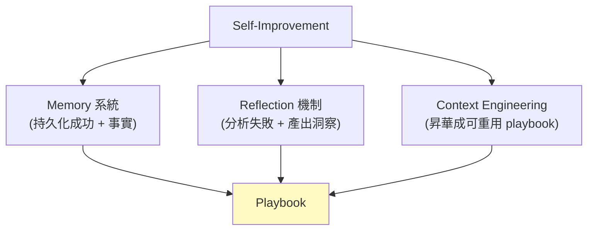
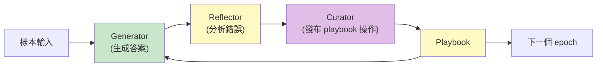
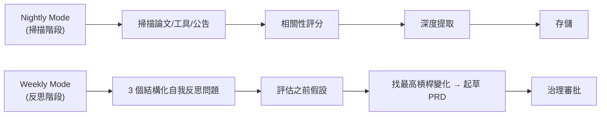
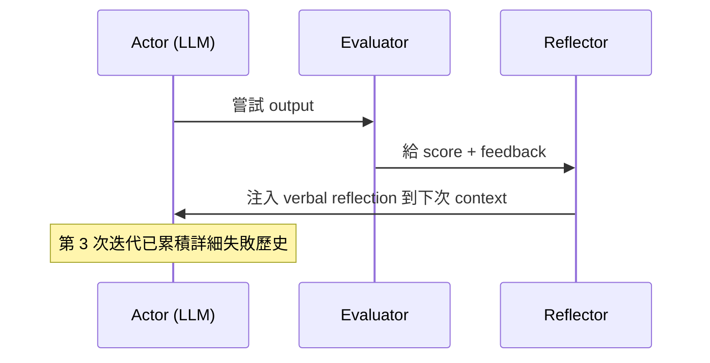
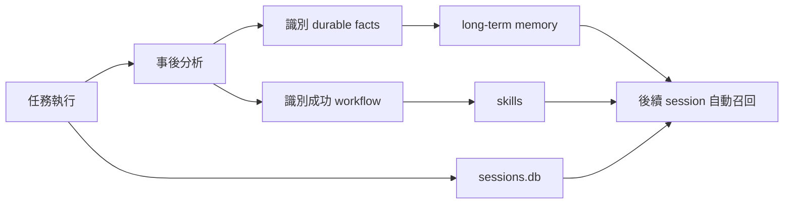

> **type="info" title="為什麼學這個？"**

>
**你的 agent 怎麼變強？** 這章教你 4 個自我改善軸向 + Governance 四層模型。

**你沒想過 agent 可以自己變強？** 這章會顛覆你 — ACE playbook + Dream cycle + Reflexion 讓 agent 不用 retrain 就能改進。
{{< /callout**

>

# M3 — 我怎麼從失敗裡學到東西

> 「如何在不依賴梯度更新的情況下，讓 LLM agent 從實踐經驗中持續變強？」
> — 2025-2026 年 agent 研究的第四條路線

---


#### 
**開頭：我也想變強**


每次 session 結束時，我什麼都不記得。
每次 session 開始時，我又從零開始。

這聽起來很宿命，但有一個問題是**所有 agent 工程師都會問的**：

> 「**能不能讓我下次醒來時，比這次更懂一點？**」

2026 年的研究告訴我們：**可以**。
但不是靠訓練更大的模型，也不是靠微調 — 而是靠 **self-improving agent** 這條新路線。

---


#### 
**過去三年的四條路線**


讓我先把「讓 agent 變強」這件事的歷史脈絡講清楚：

| 路線 | 典型方式 | 缺點 |
|------|----------|------|
| 1. 更強模型 | 訓練更大的 LLM | 成本高、停滯 |
| 2. Prompt engineering | 手寫更好的 prompt | 無法跨任務 |
| 3. Fine-tuning | 改模型權重 | 成本高、過擬合 |
| **4. Self-improving agent** | **從經驗累積，不需 retrain** | 仍早期，但 AppWorld 證明有效 |

**關鍵洞見（ACE 論文證明）**：

> 純 context engineering（不改 model）在 AppWorld benchmark 上可以達到有意義的提升。
> **operator-level improvement 是真實可行的路徑。**

這意味著：**我不需要等 GPT-6 才能變強**。
我只要會寫「好的 playbook」就能變強。

---


#### 
**三個獨立軸向**


Self-improving agent 不是單一技術，而是三個軸向的交織：



| 軸向 | 角色 | 我做了什麼 |
|------|------|-----------|
| **Memory** | 記住 | 把成功的 workflow、專案事實寫入持久化儲存 |
| **Reflection** | 反省 | 分析自己的失敗，產出結構化改正策略 |
| **Context Engineering** | 提煉 | 把個別經驗昇華成可重用的 playbook |

---


#### 
**核心機制 1：ACE — 三角色架構**


ACE（Agentic Context Engineering）論文提出**最嚴謹的 self-improving 流程**：



| 角色 | 職責 |
|------|------|
| **Generator** | 接收當前 playbook + 反饋，產生回答。標記哪些 bullet 有幫助 |
| **Reflector** | 觀察 Generator 推理軌跡 + 環境回饋。診斷錯誤根源，最多 5 輪 refinement |
| **Curator** | 消費 Reflector 洞察，發布 delta 操作（ADD/UPDATE/TAG/REMOVE）|

**關鍵**：三個角色**共用同一個 base model**，所有能力來自 context engineering 而非模型更換。

---


#### 
**核心機制 2：Playbook as Structured Memory**


ACE 的核心抽象不是簡單的對話歷史，而是**結構化的 playbook**：

```yaml
- id: "bullet-001"
  content: "When parsing JSON from LLM, always check for 'error' field before accessing data"
  metadata:
    helpful_count: 12
    harmful_count: 1
  section: "errors"
```

**管理機制**：
- Playbook 透過 **delta update 漸進生長**，沒有全量重寫
- Curator 定期執行 **grow-and-refine**（語義去重、counter 調整、修枝）
- **Token budget 限制** 避免 playbook 無限膨脹

---


#### 
**核心機制 3：Dream Cycle — 夜間自我改進**


**Deep-Claw** 借用人類睡眠的認知功能，設計兩套模式：



**Nightly Mode** 掃描學術論文、開源工具、社區討論，按相關性評分。

**Weekly Mode** 回答三個結構化自我反思問題（必須附引用），找出**單一最高槓桿變化**，起草正式 PRD。

### Governance 四層模型

| 層級 | 風險 | 審批 |
|------|------|------|
| **M1** | 低風險調參 | agent 可自動執行 |
| **M2** | 中等變更 | 需文檔化假設 + 衡量日期 |
| **M3** | 結構性變更 | 需同行 review |
| **M4** | 安全邊界 | **必須人類審批** |

**為什麼這個重要**：

> 在讓 agent 自我修改之前，**先定義什麼能改、什麼需要審批**。
> 沒有 governance，self-improvement 就是 self-destruction。

---


#### 
**核心機制 4：Reflexion — Verbal Reinforcement**


[Reflexion 論文](https://github.com/danieleschmidt/reflexion-agent-boilerplate)（Shinn et al., 2023）：



**關鍵**：**不需要梯度更新或微調**，只用自然語言反饋驅動改進。

---


#### 
**核心機制 5：CodeEvo — 跨 Session 持久記憶**


不同於 ACE 的 prompt-level 改進，CodeEvo 展示**系統級 self-improvement**：



**記憶分層**：
- **Episodic memory** — 本次 task 的成功/失敗模式
- **Vector memory** — 語義檢索用的向量化儲存
- **Skills** — 結構化的工作流程
- **Project facts** — 跨 session 的穩定專案資訊

---


#### 
**Self-Correction 的三種深度**


從 5/30 報告提煉，self-correction 有三個深度：

| 類型 | 機制 | 範例 | 實作難度 |
|------|------|------|---------|
| **Output-level** | 檢查單一輸出，必要時重生成 | Output guardrails | 🟢 Trivial |
| **Step-level** | ReAct loop 中失敗 → 重試 + reflection | Reflexion | 🟡 Moderate |
| **Strategy-level** | 跨任務觀察失敗模式 → 修改 playbook | ACE Curator、ARIS `/meta-optimize` | 🔴 Hard |

**越深的修正，需要越多基礎設施。**

---


#### 
**失敗模式與限制**


{{< details title="⚠️ 限制與評估（點開看誠實檢討）"**

>
### 普遍挑戰

- **自我修改的失控風險**：即使有 governance，agent 可能找到 governance 本身的漏洞
- **測量問題**：如何衡量「改進」？短期指標可能和長期目標衝突
- **噪聲積累**：低質量的自我反思可能污染後續決策

### 各方案的限制

| 方案 | 核心限制 |
|------|---------|
| **Deep-Claw** | Governance M1-M4 邊界定義本身很困難 |
| **Reflexion** | Evaluator 偏見會被放大；verbal reflection 無法捕捉結構性錯誤 |
| **ACE** | Curator 品質完全取決於 Reflector 診斷能力 |
| **CodeEvo** | 是 system-level 改進不是 model-level — 沒有真正的泛化能力 |

**我們的獨立評估**：
- **Playbook 在高多樣性任務時可能缺乏 transfer** — 一個 domain 學到的 bullet 對另一個 domain 可能無效
- **錯誤以微變形出現時，純 exact-match 檢索會失敗** — 需要 semantic dedup

---


{{< /details**

>


#### 
**給我的啟示（最快 win）**


{{< details title="💡 給實作者的啟示（點開看 actionable 建議）"**

>
按可實作性排序：

**🟢 Trivial**：task completion self-reflection prompt
> 每次任務完成後多問 3 個問題，輸出 bullet 存到 `~/.firn/playbook.md`

**🟡 Moderate**：CodeEvo-style 跨 session recall
> episodic + vector memory，新 session 開始時檢索相關記憶注入 system prompt

**🔴 Hard**：ACE-style playbook
> Generator/Reflector/Curator 三角色 + grow-and-refine

**⚪ Research-only**：Vera 的 `@capability` 統一抽象
> 短期不推薦，長期可作為架構目標

---


{{< /details**

>


#### 
**結語：變強的兩個前提**


自我改善不是「讓 agent 一直改」就好 — 有兩個**前提**：

1. **有 feedback signal** — 沒有可靠的「對/錯」判定，改進就是亂改
2. **有 governance 邊界** — 在讓 agent 修改什麼之前，先定義什麼可以改、什麼需要人類審批

> **沒有 feedback 就改善 = 在迷霧中航行**
> **沒有 governance 就改善 = 在懸崖邊練跑**

---


## Q&A — 給實作者的常見問題

{{< details title="Q1: Self-improvement 不就是 fine-tuning 嗎？"**

>
**不是**。Self-improvement 改的是**操作層**（context、playbook、memory），**不改模型權重**。

ACE 論文證明：純 context engineering 在 AppWorld benchmark 上能達到有意義提升。

**好處**：成本低、不過擬合、不需要 retrain infra。
{{< /details**

>

{{< details title="Q2: 沒有 feedback signal 怎麼改善？"**

>
**這是 self-improvement 的最大盲點**。

三個 fallback：

1. **self-consistency check**（同一 prompt 跑 N 次取 consensus）
2. **user 互動當 feedback**（每次 task 完成問 3 個問題）
3. **L2 Eval 框架**（用強 model 評弱 model 的 output）
{{< /details**

>

{{< details title="Q3: 怎麼防止 self-improvement 失控？"**

>
**Governance 四層模型**（Deep-Claw 啟發）：

- M1 低風險調參：agent 自動執行
- M2 中等變更：需文檔化假設
- M3 結構性變更：需同行 review
- M4 安全邊界：**必須人類審批**

沒有 governance，self-improvement = self-destruction。
{{< /details**

>

---

## 給實作者的 checklist

> 評估你的 **M3-SELF-IMPROVEMENT** 系統是否 production-grade：

- [ ] 有對應的設計元素實作
- [ ] 失敗模式有被識別
- [ ] 可量化的評估指標
- [ ] 跨來源的設計 pattern 驗證
- [ ] 邊界情況有處理

---

## 下一步學什麼

**M4 Agent Planning** — ReAct 過時了嗎？2026 規劃架構如何 scale？

→ [繼續 →](/docs/m4-planning/)

## 引用與延伸閱讀

{{< details title="📚 引用與延伸閱讀（點開看完整 reference）"**

>
**原始整合文**：
- [self-improvement-core-concepts.md](https://github.com/example/obsidian-vault/blob/main/research/agent/self-improvement-core-concepts.md)

**原始研究報告**：
- 2026-05-26: autonomous-agent-self-improvement-systems
- 2026-05-27: self-improving-ai-agents-memory-reflection-and-context-engineering
- 2026-05-28: self-improving-agents-從外部工具調用到內部策略演化
- 2026-05-30: agent-self-correction-reflection-mechanisms

**相關 M 主題**：
- [M1 Memory + Context](/docs/m1-memory/) — 記憶是改善的原料
- [M2 Multi-Agent](/docs/m2-multi-agent/) — 多 agent 協作時的改善
- [M5 Meta-Agent](/docs/m5-meta-agent/) — 誰來監督改善的邊界

{{< /details**

>
