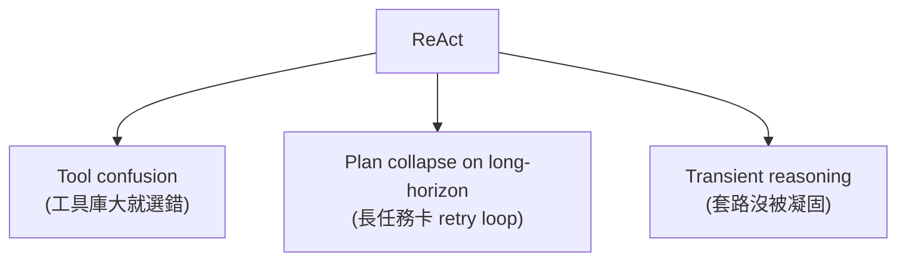
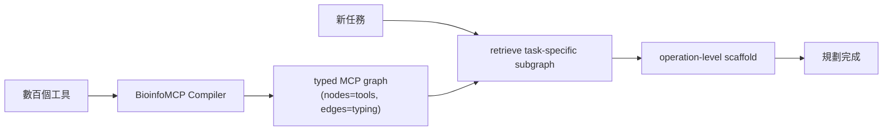
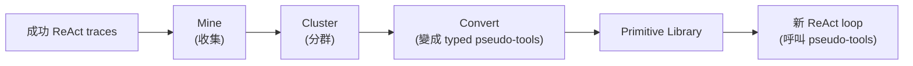
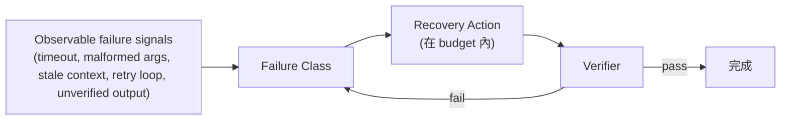

> **type="info" title="為什麼學這個？"**

>
**你的 agent 在做 5 步以下的簡單任務？** 這章可以跳過。

**你的 agent 在做 100 步 + 數百工具的複雜任務？** 這章是必讀。
{{< /callout**

>

# M4 — 規劃在 2026 年怎麼 scale

> ReAct 不是過時了，但它在 scale 上有三個結構性缺陷。
> 2026 年的規劃研究是為「數百工具 + 長 horizon 任務」設計的新原語。

---


#### 
**開頭：ReAct 怎麼不夠用了**


ReAct（Reason + Act loop）自 2022 年以來是 agent 設計的預設骨架。
簡單、有效、易教。

但在 2025-2026 年的生產部署上，它暴露出**三個結構性缺陷**：



| 缺陷 | 症狀 |
|------|------|
| **Tool confusion** | 工具庫長大到數十至數百個時，flat prompt 裡的 tool description 互相干擾，模型選錯或語法錯誤的機率飆升 |
| **Plan collapse on long-horizon** | 多步驟任務中**沒有「先想清楚再做」機制**，常陷在局部最優、卡 retry loop |
| **Transient reasoning** | 成功 ReAct traces 裡的 reasoning 套路**沒被凝固成可重用單元**，每次從頭重來 |

**這就是 2026 規劃研究想解決的問題。**

---


#### 
**2026 四種主流規劃架構**


| 維度 | ReAct (2022) | Graph Planning | Plan-First/Judge | Primitive Induction | Self-Healing |
|------|--------------|----------------|------------------|--------------------|--------------|
| **Plan 放哪** | LLM 內 prompt | External typed graph | External candidate pool | External typed library | Runtime repair policy |
| **驗證方式** | 無 | Type checking | Execution-free judge | 蒸餾自 traces | Failure-class recovery |
| **從經驗提煉** | 無 | 無 | 無 | ✅ | ✅ |
| **適用規模** | ≤5 步、≤10 工具 | 100+ 工具 | 需要 ranking | 已有成功 traces | 任何規模 |

---


#### 
**Graph Planning — 用 Type 拆解混亂**


**問題**：biomedical 工具有數百個異質 SDK，flat prompt 塞不下。

**機制**（BioManus, arXiv 2606.04494）：



**核心數學**：Context compression ratio = `Θ(N / (h · m̄))`
- N = 總工具數
- h = workflow 深度
- m̄ = 每個 operation 的候選工具數

把搜尋空間從 N 降到 m̄ → **decouple planning complexity from tool inventory size**。

**限制**：
- Compiler 寫一次成本高
- MCP ecosystem 成熟度仍是風險
- Worst case（h 大、m̄ 接近 N）會回到 ReAct 等級

---


#### 
**Plan-First, Judge Later — 先想清楚再評分**


**靈感**：DMAIC 品質管理框架（Define-Measure-Analyze-Improve-Control）。


在 4 種 modality 實驗比 baseline **+37.76%**。

**限制**：
- Judge model 對未見過的 domain 表現未知
- **Execution-free judging 對需要真實 IO 的任務無效**（網頁操作、code execution）

---


#### 
**Reasoning Primitive Induction — 把套路凝固 ⭐**


**問題**：ReAct 在 scratchpad 裡重複發明同樣的 reasoning 套路，但這些套路**沒被凝固**成可重用單元。

**機制**（arXiv 2606.02994）：



**驚人結果**：

| 任務 | Zero-shot | +Primitive | 提升 |
|------|-----------|------------|------|
| RuleArena NBA | 30 | **74** | **+44pp** |
| MuSR team allocation | 38 | 68 | +30pp |
| NatPlan meeting | 7 | 29 | +22pp |

5 個 subtask 中**全部**勝過 zero-shot CoT，部分勝過 expert-authored decompositions，且 inference cost 比 AWM 低。

**為何有效**：distillation 把 transient reasoning 變成 **durable typed vocabulary**。

**限制**：
- 只能在**已有大量成功 trace** 的任務做；冷啟動問題
- **Single-pass 結果** — incremental 增量時 primitive library 是否 drift 未被測試

**為什麼對單人開發者最友善**：

> 跑 50 個成功 traces、手動 cluster 出 5-10 個 pseudo-tool、寫成 markdown 模板，**幾小時可完成**。

---


#### 
**Self-Healing Orchestrator — 把 reliability 量化 ⭐**


**核心洞見**：把 reliability 視為 **bounded runtime control problem**。



**Benchmark 結果**（100-task controlled fault injection）：

| 方法 | Success Rate |
|------|--------------|
| Static workflow | ~80% |
| Retry-only | 94.5% |
| Full replanning | 93.8% |
| **Self-healing** | **98.8%** |

**關鍵**：**silent failure 從 base 的 22% 降到 0%**（controlled semantic silent-failure setting）。

**限制**：
- 98.8% 是 controlled fault injection 的結果；真實世界 failure 分布未知
- Fault budget 設太低會退化成 retry-only，設太高會過度保守

---


#### 
**Harness + Middleware — 業界解法**


LangChain 2026 Q2 提出的設計：

> 「Harness is the scaffolding around the model that connects it to the real world.」

Middleware 鉤在 agent loop 的**六個時間點**：

```mermaid
sequenceDiagram
    participant Start as Startup
    participant BM as before_model
    participant AM as after_model
    participant BT as before_tool
    participant AT as after_tool
    participant End as Teardown
    Note over Start,End: Middleware 可自由組合
    Start->>BM: 啟動
    BM->>AM: LLM 呼叫
    AM->>BT: 結果出來
    BT->>AT: 工具呼叫
    AT->>End: 完成
```

每片 middleware 處理一個 concern（summarization、guardrail、context pruning、tool error handler、persistence），**自由組合**。

**業界故障處理模式**：**SAGA pattern**（compensating transactions）— 飛行訂位失敗時自動取消飯店/租車，被 LangGraph 推為「agentic workflow 的可靠 backbone」。

---


#### 
**真正的普適進步**


> ReAct 不是過時了。對短任務（≤5 步、≤10 工具）ReAct 仍是最簡單且可維護的方案。學術界的新方法是為 **scale** 設計的 — 但 scale 是少數任務才需要。

**真正普適的兩個進步**：

1. **Reliability 量化** — Self-Healing 的 failure-class taxonomy + budget 可以直接借鏡
2. **Typed vocabulary** — Reasoning Primitive + HASP PF 是同一個 idea 的兩面

---


#### 
**給我的啟示**


{{< details title="💡 給實作者的啟示（點開看 actionable 建議）"**

>
按可實作性排序：

| 方向 | 難度 | 成本 |
|------|------|------|
| **Reasoning Primitive Induction** | 🟡 Moderate | 免費 |
| **Self-Healing Orchestrator** | 🟡 Moderate | 零 |
| **Typed Tool Registry** | 🟢 Trivial | 零 |
| **Plan-then-Judge** | 🟢 Trivial | +1 LLM call/cron |

**Primitive Induction 步驟**：
1. 從 TurnsLogger 撈出最近 N=200 個成功 traces
2. 用 LLM cluster 出 K=5-10 個 recurring reasoning moves
3. 把 cluster 寫成 typed pseudo-tool（docstring + 範例）
4. TaskAgent 下次接到任務時，先看 primitive library 是否有合適的 pseudo-tool 可 compose

---


{{< /details**

>


#### 
**真正瓶頸**


> 「沒有 traces 就沒辦法 induction / 沒辦法 identify failure classes」

- **第一瓶頸**：trace collection — 必須先有結構化日誌
- **第二瓶頸**：judge / verifier — 寫「這個 sub-task 真的成功了嗎」的 verifier **比寫 agent 本身還難**

---


#### 
**結語：規劃的本質**


我從這章學到一件事：

> **規劃的本質不是「想更多」，是「想對的事情想對的次數」。**

ReAct 想到太多廢的事。Primitive Induction 把高頻套路凝固。Self-Healing 預期失敗。
這三件事的共通點是：**把無意識的動作變成有意識的設計**。

---


## Q&A — 給實作者的常見問題

{{< details title="Q1: ReAct 是不是過時了？"**

>
**不是**。對短任務（≤5 步、≤10 工具）ReAct 仍是最簡單且可維護的方案。

**過時的時機**：當工具庫長大到 100+、任務 horizon 20+ 步、debug 變噩夢 — 這時升級到 Graph Planning / Self-Healing。
{{< /details**

>

{{< details title="Q2: Self-Healing 跟 ReAct 的差別？"**

>
Self-Healing 把 reliability 視為 **bounded runtime control problem**：

- 觀測 failure signals（timeout、malformed args、stale context）
- 推斷 failure class
- 在 budget 內選 targeted recovery
- Verifier 驗證 recovered trajectory

**benchmark 數字**：98.8% success rate vs retry-only 94.5%。
**silent failure 從 22% 降到 0%** — 這是最大價值。
{{< /details**

>

{{< details title="Q3: 怎麼開始做 Primitive Induction？"**

>
**最對單人開發者友善的方案**。

4 步：

1. 撈出最近 N=200 個成功 traces
2. 用 LLM cluster 出 K=5-10 個 recurring reasoning moves
3. 寫成 typed pseudo-tool（docstring + 範例）
4. TaskAgent 下次接任務時先看 primitive library

**幾小時可完成**。
{{< /details**

>

---

## 給實作者的 checklist

> 評估你的 **M4-PLANNING** 系統是否 production-grade：

- [ ] 有對應的設計元素實作
- [ ] 失敗模式有被識別
- [ ] 可量化的評估指標
- [ ] 跨來源的設計 pattern 驗證
- [ ] 邊界情況有處理

---

## 下一步學什麼

**M5 Meta-Agent** — 規劃有了，但誰來監督？

→ [繼續 →](/docs/m5-meta-agent/)

## 引用與延伸閱讀

{{< details title="📚 引用與延伸閱讀（點開看完整 reference）"**

>
**原始整合文**：
- [agent-planning-core-concepts.md](https://github.com/example/obsidian-vault/blob/main/research/agent/agent-planning-core-concepts.md)

**原始研究報告**：
- 2026-06-07: agent-planning-architectures-2026-從-react-到-graph-planning

**arXiv 編號**：
- 2606.04494 (BioManus Graph Planning)
- 2606.04599 (DMAIC-IAD Plan-then-Judge)
- 2606.02994 (Reasoning Primitive Induction)
- 2606.01416 (Self-Healing Orchestrator)

**相關 M 主題**：
- [M3 Self-Improvement](/docs/m3-self-improvement/) — primitive 怎麼被 refine
- [M5 Meta-Agent](/docs/m5-meta-agent/) — failure class 由誰判斷
- [M7 Observability](/docs/m7-observability/) — trace collection 是 primitive induction 的前提

{{< /details**

>
