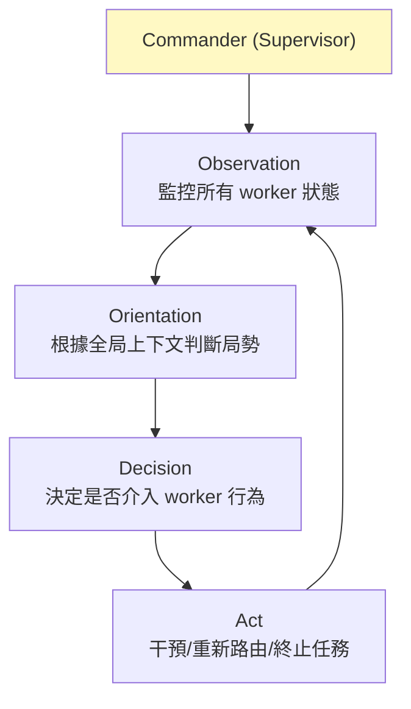
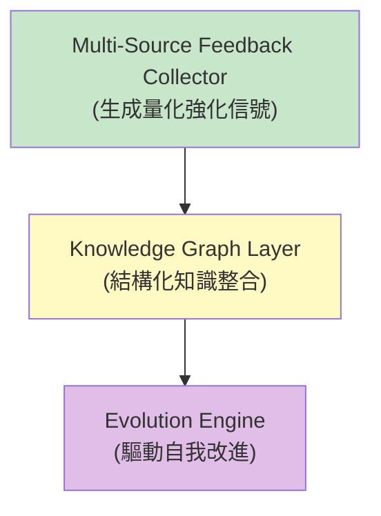
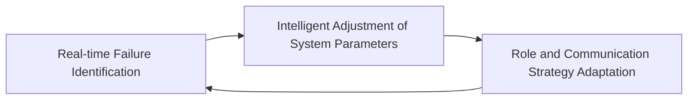
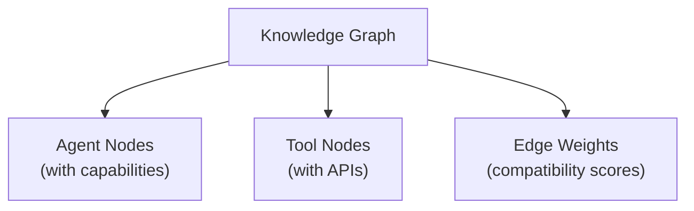

> **type="info" title="為什麼學這個？"**

>
**你的 multi-agent 系統需要 supervisor 嗎？** 這章教你 5 種監督架構。

**什麼時候需要 supervisor？**

- Worker agent 開始幻覺
- 失敗率 5-20% 不可忽略
- 沒有結構化的失敗偵測機制

> 「誰來監督 agent 的行為？」當 multi-agent 系統複雜度上升，單靠靜態角色定義已不足。
> 2025-2026 趨勢：從靜態角色定義 → 動態、可演化、具備自我診斷能力的 supervisor。

---


#### 
**開頭：誰來監督我？**


這個問題聽起來哲學，但實務上很具體：

> 當 worker agent 開始幻覺、偏離目標、或在 retry loop 裡無限轉圈時，**誰踩煞車？**

multi-agent 系統複雜度上升，單靠靜態角色定義已不足。
需要**動態、可演化、具備自我診斷能力的 supervisor**。

這章講的就是 2026 年對「meta-agent」這個角色的共識。

---


#### 
**三個核心問題**


不管用什麼架構，meta-agent 監督都要回答三個問題：

| 問題 | 細節 |
|------|------|
| **誰來監督 agent 行為？** | Worker agent 產生幻覺或偏離目標時如何偵測與糾正？ |
| **如何避免 error cascade？** | FTDI 研究：minor perturbations 在長互動鏈中**會被放大** |
| **Supervisor 本身是否需要被監督？** | 無限遞迴的監督問題 |

第三個問題最難 — 答案通常是「**多層監督**」（不是遞迴監督，而是分層）+「**人類在最高層**」。

---


#### 
**五種監督架構**


| 架構 | 代表 | 核心機制 | 適用 |
|------|------|----------|------|
| **Hierarchical Supervisor** | HOLA、LLM-Agent-UMF | OODA 迴圈 commander | 任務分解 + 並行 worker |
| **Self-Evolving Meta-Agent** | SEMAF | 三層：Evolution/KG/Feedback | 動態 agent 重構 |
| **Disruption-Aware** | ALAS | Stateful + disruption 分類 + recovery | 長時任務、容易中斷 |
| **Adaptive Coordination** | AROMA | 感知 → 診斷 → 適應迴圈 | 成本敏感、動態調整 |
| **Agent-as-a-Graph** | 2026 papers | Knowledge graph 檢索 agent 組合 | 大量異質 agent/tool |

---


#### 
**Hierarchical Supervisor — OODA 指揮官**


**HOLA** 的核心是 OODA（Observe-Orient-Decide-Act）迴圈：



**LLM-Agent-UMF** 進一步區分：
- **Active Core-Agent** — 負責決策
- **Passive Core-Agent** — 負責執行

讓 supervisor 角色更清晰。

---


#### 
**SEMAF — Self-Evolving Meta-Agent**


**這個領域最完整的理論框架**：



**核心洞察**：

> 靜態角色協作不夠，需要動態重構 agent 結構。
> SEMAF 允許 agent 自我診斷、學習、重組。

**限制**：
- Knowledge graph layer 建構與維護本身需大量資源
- **Catastrophic forgetting** 問題（聲稱解決但可能是理論簡化）
- 缺乏 production-level 開源實作

---


#### 
**ALAS — Disruption-Aware**


**核心**：把任務中斷當成 first-class 概念。

**三個關鍵設計**：
- **State persistence** — 維護每個 agent 的對話/執行狀態
- **Disruption detection** — 辨識規劃中斷
- **Recovery strategies** — 針對不同中斷類型有不同恢復策略

```python
if disruption_detected:
    agent_state = save_state()
    disruption_type = classify()  # 幻覺型 / 延遲型 / 死循環型
    recovery_plan = get_recovery_strategy(disruption_type)
    execute_recovery(recovery_plan)
    resume_from_saved_state()
```

**限制**：Stateful 框架的狀態管理複雜度增加，**記憶體佔用隨 agent 數量線性成長**。

---


#### 
**AROMA — Adaptive Coordination ⭐**


**核心**：動態感知 → 診斷 → 適應迴圈。



**AROMA 的關鍵發現**：

> 現有 MAS 系統**通常只有 modest performance gains，甚至 performance setbacks**。
> 同時 token consumption 大幅增加。

主要失敗模式：
- 不當的 task decomposition
- 資訊過載（information overload）

**AROMA 的解法**：讓 supervisor 具備**即時 failure identification 能力**，並根據診斷結果動態調整協作策略。

**這挑戰了「multi-agent 必然更好」的假設。**

---


#### 
**Agent-as-a-Graph**


**用知識圖譜做 tool 和 agent 的檢索**：



Supervisor 根據任務需求，**在圖譜中找到最適合的 agent 組合**，而非靜態分配角色。

---


#### 
**普遍限制**


> 評估你的 **M5-META-AGENT** 系統是否 production-grade：

- [ ] 有對應的設計元素實作
- [ ] 失敗模式有被識別
- [ ] 可量化的評估指標
- [ ] 跨來源的設計 pattern 驗證
- [ ] 邊界情況有處理

---

## 下一步學什麼

**M6 Code vs Tool** — 你的 agent 應該用 JSON 還是用 code 行動？

→ [繼續 →](/docs/m6-code-vs-tool/)

## 引用與延伸閱讀
