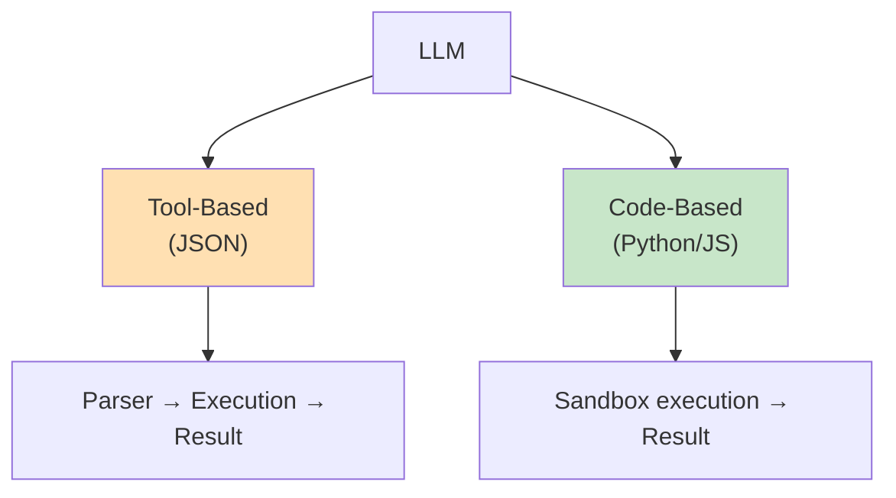
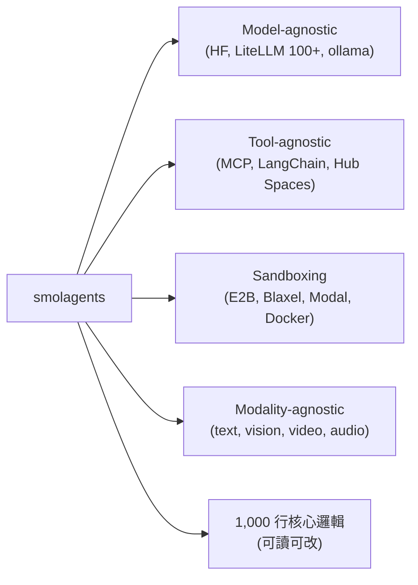
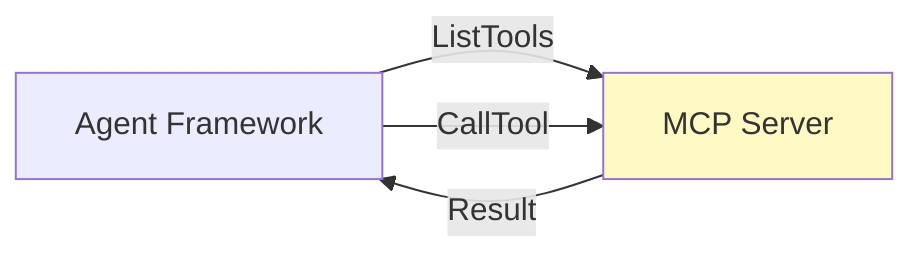
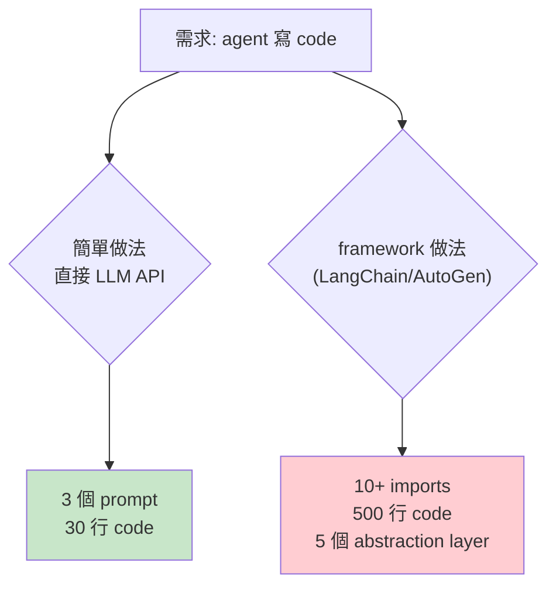

> **type="info" title="為什麼學這個？"**

>
**你的 agent 在做簡單工作？** 用 Tool-Based (JSON) 就好。

**你的 agent 在做多步組合、context 敏感？** 換到 Code Agent。

> LLM 如何選擇行動？如何執行？2024-2025 主流是 JSON tool call，2025 年中起另一條路線崛起：「agents that think in code」。

---


#### 
**開頭：兩條路**


我有兩種方式「做一件事」：



2024-2025 主流是 JSON tool call — 我吐一個 JSON 物件，framework 解析後執行。
2025 年中起，**agents that think in code** 這條路線開始崛起 — 我直接寫可執行程式碼。

**為什麼這個分野重要？** 因為它影響**所有**下游設計 — 可靠性、可組合性、context 效率、模型要求、除錯體驗。

---


#### 
**兩條路線的對比**


| 維度 | Tool-Based (JSON) | Code Agents |
|------|-------------------|-------------|
| **動作表示** | 結構化 JSON | 可執行程式碼 |
| **代表框架** | LangChain (138K)、AutoGen (58K)、CrewAI、OpenAI Agents SDK | smolagents (27.5K) |
| **可靠性** | parse error、escaping bug、格式錯誤常見 | **對 LLM 更自然**（它本就受過大量 code 訓練）|
| **可組合性** | 一輪 LLM→tool→LLM | **可一次組合多個操作** |
| **除錯** | 只能看字串 | **可 print、inspect、version control** |
| **多輪效率** | 低（每 call 一次 LLM 迴圈）| 高（單次程式碼可做多步）|
| **Context 消耗** | 高 | 低（結果可變數）|
| **模型要求** | 中（小模型可）| 高（**需較強 coding 能力**）|
| **Sandbox** | 不需要 | 必須（E2B/Blaxel/Modal/Docker）|

---


#### 
**Tool-Based 的關鍵設計教訓：ACI**


**ACI = Agent-Computer Interface**。
tool 格式設計要像給 junior developer 寫的 docstring：

- **Diff format 需要事先知道改了幾行** — 對 LLM 困難
- **JSON 內嵌程式碼需要 escaped newlines** — 容易出錯
- **格式要接近網路上自然出現的文本**
- **工具文件要像 docstring**（example、edge cases、典型使用情境）

> 一個好的 tool description 比 100 行程式碼重要。

---


#### 
**Code Agents：smolagents 設計解析**


```python
from smolagents import CodeAgent, DuckDuckGoSearchTool, HfApiModel
agent = CodeAgent(tools=[DuckDuckGoSearchTool()], model=HfApiModel())
agent.run("How many seconds would it take for a leopard at full speed to run through Pont des Arts?")
```

**核心設計原則**：



**為什麼 smolagents 值得關注**：
- 1000 行核心邏輯 — 輕量、可讀、可改
- 完全 open source
- 同時支援 tool-based + code-based

---


#### 
**MCP — Tool Calling 通用協議**


**2025 年崛起的 tool calling 通用協議**：



**生態規模**：
- 官方 SDK（Go 4.6K、C# 4.3K）
- 社群伺服器 registry（6.9K）
- 延伸：Chrome MCP (11.7K)、XcodeBuildMCP (5.8K)、Playwright MCP (5.5K)

**核心價值**：
- **大一統介面** — 不再每個 framework 各自定義 tool schema
- **Client-Server 架構** — MCP server 可單獨部署、版本控制、分享
- **生態快速成長** — 從 IDE 延伸（Cursor、Windsurf）到生產基礎設施

**MCP 解決「工具發現」，不解決 orchestration**。
這跟 [M2 Multi-Agent](/docs/m2-multi-agent/) 的 orchestration 是兩件事。

---


#### 
**Orchestration 層的取捨**


### Anthropic 的警告

> "These frameworks often create extra layers of abstraction that can obscure the underlying prompts and responses, making them harder to debug. They can also make it tempting to add complexity when a simpler setup would suffice."

**Simple patterns beat complex frameworks**：



**建議**：
- 先用 LLM API 直接實作
- 複雜度增加時再評估 framework
- 「many patterns can be implemented in a few lines of code」

### Agno 的對應策略

- **Build agents using any framework**
- **Run with tracing/scheduling/RBAC**
- **Manage from single control plane**
- 支援 100+ 工具整合、Storage、Observability、Human approval

---


#### 
**怎麼選？給實作者的決策**


| 條件 | 推薦 |
|------|------|
| 小模型、Hobby project | Tool-Based (LangChain) |
| 強模型、需要多步組合 | Code-Based (smolagents) |
| 需要 MCP 工具生態 | Tool-Based + MCP client |
| Production、需要 sandbox | Code-Based + E2B/Docker |
| 學習/研究 | 先 Tool-Based 直接 API，再升級 |

**我的判斷**：
- **80% 的場景用 Tool-Based 就夠了**
- **剩下 20% 需要 Code Agent**（多步組合、context 敏感）
- **不要預設 framework** — 先用 LLM API 直接實作

---


#### 
**給我的啟示**


> 評估你的 **M6-CODE-VS-TOOL** 系統是否 production-grade：

- [ ] 有對應的設計元素實作
- [ ] 失敗模式有被識別
- [ ] 可量化的評估指標
- [ ] 跨來源的設計 pattern 驗證
- [ ] 邊界情況有處理

---

## 下一步學什麼

**M7 Observability** — 你的 agent 跑久了怎麼 debug？

→ [繼續 →](/docs/m7-observability/)

## 引用與延伸閱讀
