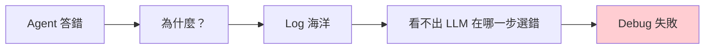
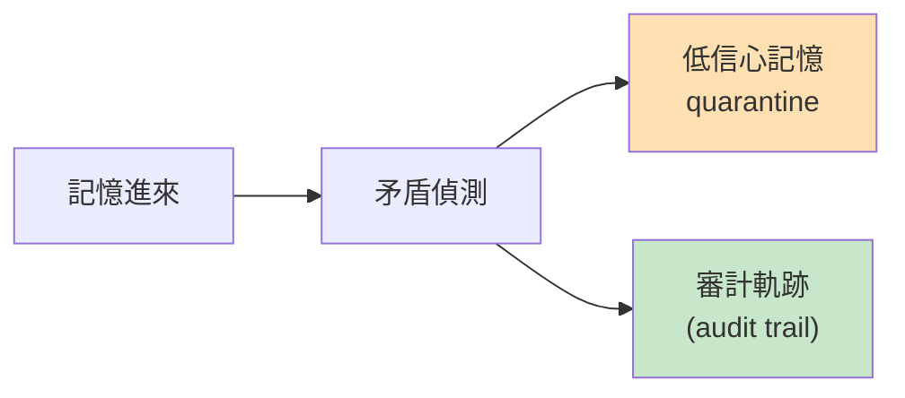
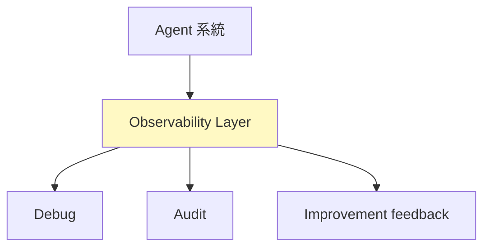

> **type="info" title="為什麼學這個？"**

>
**你的 agent 跑 production 出事？** 這章教你 4 個解法 + Memory self-governance。

**你還沒跑 production？** 這章仍然必讀 — observability 是基礎設施，**現在不做以後會痛**。
{{< /callout**

>

# M7 — 跑久了怎麼 debug

> 當 AI agent 在生產環境跑久了，最大的噩夢不是「回答錯誤」，是「不知道為什麼錯」。
> Observability 從「加分」變「必要」。

---


#### 
**開頭：噩夢不是錯，是「不知道為什麼錯」**


跑 agent 系統最痛苦的不是「它答錯了」。
是「**它答錯了，我打開 log 看，發現我完全不知道它為什麼這麼選**」。



Observability 在 2026 變必要不是因為「debug 體驗」這種小事 —
是因為 **agent 自主性提升** 跟 **架構複雜度上升** 兩個力量同時擠壓。

- Agent 自主決策多了 → 出錯時你需要完整 replay
- Multi-agent 串起來了 → 一個 worker 失敗會 cascade
- Memory-augmented 跑久了 → 不知道 agent 「記得」什麼

**沒有 observability 的 agent 系統是個黑盒**，跑 production 就是賭博。

---


#### 
**四個核心解法**


| 工具 | 核心價值 | 層 |
|------|----------|-----|
| **Memoria** | Memory 自我治理（Git for AI Memory）| Storage layer |
| **OpenLIT** | OpenTelemetry-native LLM observability | Telemetry layer |
| **OpenViking** | Context 當檔案系統管理（L0/L1/L2）| Context layer |
| **AgentPrism** | Trace 可視化 UI | Visualization layer |

---


#### 
**Memoria — Git for AI Agent Memory ⭐**


**核心洞見**：記憶不只是「存放」，是「版本控制」。

**Git 操作直接移植到 agent 記憶**：

```python
memory_branch(name="eval_sqlite")    # 開實驗分支
memory_checkout(name="eval_sqlite")  # 切換分支
memory_merge(source="eval_sqlite")   # 合併或刪除
memory_diff(source="branch")          # 預覽差異
# Snapshot + rollback at any point-in-time
```

**底層**：MatrixOne MVCC（arXiv 2604.03927, 2026-04）— TB 等級資料上做 clone/branch/diff/merge/revert 是 **near-instantaneous**，不需要把整個 dataset 載入記憶體。

### 自我治理（Self-Governance）



- **自動偵測記憶矛盾** — 不會假裝沒事
- **隔離低信心記憶** — quarantine 而非直接寫入
- **維護完整 audit trail**

這是這個領域最重要的概念：

> **Memory 不再只是 storage，是 governance。**

### 對比傳統 RAG

| 維度 | Memoria | Letta/Mem0/Traditional RAG |
|------|---------|----------------------------|
| Version control | **Native zero-copy snapshots & branches** | File-level or none |
| Isolation | **One-click branch** | Manual data duplication |
| Audit trail | **Full snapshot + provenance** | Limited logging |
| Retrieval | Vector + fulltext hybrid | Vector only |
| **Self-governance** | **Auto contradiction detection & quarantine** | Manual cleanup |

**對「Git 類比」的懷疑**：
Memoria 宣稱「Git for AI Agent Memory」，但 **Git 的核心價值是協作**（多人對同一 codebase）+ **branch/merge review**。
Agent memory 的 branch/merge 更多是「實驗性嘗試」而非多人協作。
**「Git 類比」可能有 marketing 成分高於實質**。

---


#### 
**OpenLIT — OpenTelemetry-native LLM Observability**


**優雅**：

```python
import openlit
openlit.init(otlp_endpoint="http://127.0.0.1:4318")
```

一行就接上 OpenTelemetry backend。

**核心功能**：

| 功能 | 說明 |
|------|------|
| **11 種 built-in evaluation** | hallucination, bias, toxicity, safety, instruction following, completeness, conciseness, sensitivity, relevance, coherence, faithfulness |
| **LLM-as-a-Judge** | context-aware（以提供的 context 為 ground truth）|
| **Rule Engine** | AND/OR 邏輯定義條件規則 |
| **Prompt Hub** | 版本化、管理 prompts |
| **Cost Tracking** | 自訂模型定價檔案，精確預算 |
| **Fleet Hub** | OpAMP 管理多個 OpenTelemetry Collectors |

支援 Python/TypeScript/Go SDK，**vendor-neutral**（接任何相容 OpenTelemetry 的 backend）。

---


#### 
**OpenViking — Context 當檔案系統**


**放棄傳統 RAG 的 flat vector storage**，把 context 管理當檔案系統設計。

### 五層挑戰對應五個解法

| 挑戰 | OpenViking 解法 |
|------|-----------------|
| Fragmented Context | **Filesystem paradigm**（統一管理 memories/resources/skills）|
| Surging Context Demand | **L0/L1/L2 三層漸進載入**（按需載入節省 token）|
| Poor Retrieval | **目錄定位 + 語意搜尋**，遞迴精確獲取 |
| Unobservable Context | **可視化 retrieval trajectory**，可看 root cause |
| Limited Memory Iteration | 自動壓縮對話內容，萃取長期記憶 |

### L0/L1/L2 三層架構

- **L0** — 壓縮後的濃縮記憶
- **L1** — 中度摘要
- **L2** — 完整原始內容

**按需漸進載入**，agent 需要什麼深度就載到哪層。
（這跟 [M1 Memory](/docs/m1-memory/) 的 L0/L1/L2 是同源概念）

---


#### 
**AgentPrism — Trace 可視化 UI**


**把 OpenTelemetry trace data 轉成 React component**，主打「讓 trace 不是 JSON 海洋」：

```tsx
<TraceViewer
  data={[{
    traceRecord: yourTraceRecord,
    spans: openTelemetrySpanAdapter.convertRawDocumentsToSpans(yourTraceData),
  }]}
/>
```

**提供**：
- **Trace List** — 多筆 trace 列表
- **Tree View** — 階層式 span 可視化，支援搜尋和 expand/collapse
- **Details Panel** — 單一 span 屬性檢視
- **Adapter 模式** — OpenTelemetry、Langfuse 等格式都可轉換

---


#### 
**限制與誠實評估**


{{< details title="⚠️ 限制與評估（點開看誠實檢討）"**

>
| 方案 | 核心限制 |
|------|---------|
| **Memoria** | 依賴 MatrixOne（不是主流 DB）；self-governance 矛盾偵測沒有實作細節 |
| **OpenLIT** | 對小型專案可能 Over-engineered；需 OTel Collector + backend |
| **OpenViking** | 文件主要在 volcengine 生態系；L0/L1/L2 實作細節語焉不詳 |
| **AgentPrism** | Alpha release，API 不穩定；只是 React component 不是完整 observability |

---


{{< /details**

>


#### 
**給我的啟示**


{{< details title="💡 給實作者的啟示（點開看 actionable 建議）"**

>
| 方向 | 難度 | 具體 |
|------|------|------|
| **Memoria-style self-governance** | 🟡 Moderate | 每次 `memory_store` 新 fact 前先 query 現有記憶，有衝突就標記 conflict 而非 overwrite |
| **OpenViking-style tiered context** | 🟢→🟡 | L0/L1/L2 三層直接映射現有 memory tiers |
| **OpenLIT-style lightweight observability** | 🔴 Hard | 需先建立 action execution middleware |
| **AgentPrism trace viewer for batch debugging** | ⚪ Research-only | 實際價值有限 |

**立即可做**（用 SQLite 替代 MatrixOne 做原型）：

> 不需要 MatrixOne，用 **SQLite 的 JSON 欄位** 就可以做 prototype。
> 概念：「記憶有矛盾時要能偵測和隔離」

---


{{< /details**

>


#### 
**結語：可觀測性是基礎設施**


我從這章學到一件事：

> **Observability 不是 agent 系統的加分項，是基礎設施。**



沒有 observability：
- 出了問題不知道為什麼
- 跑了 3 個月不知道有沒有偏離目標
- 改了什麼不知道有沒有效

有了 observability：
- 完整 trace 可以 replay
- 失敗模式可以量化（[M5 Meta-Agent](/docs/m5-meta-agent/) 的 failure-class taxonomy 才有資料）
- 改善可以驗證（[M3 Self-Improvement](/docs/m3-self-improvement/) 的 playbook 才有效）

---


## Q&A — 給實作者的常見問題

{{< details title="Q1: 為什麼 Observability 對 agent 特別重要？"**

>
**Agent 失敗不是「回答錯」是「不知道為什麼錯」**。

**沒有 observability 的 agent 系統是黑盒** — 跑 production 就是賭博。

**4 個必要能力**：

1. **完整的 trace**（不是 log 海洋）
2. **失敗模式分類**（不只「錯了」要說「哪一類錯」）
3. **Memory governance**（防矛盾、防毒）
4. **可審計**（誰在什麼時候做了什麼）
{{< /details**

>

{{< details title="Q2: Memoria 跟 OpenLIT 怎麼選？"**

>
**Memoria** — 解決 Memory 自我治理（Git for AI Memory）。需要 version control、branch、contradiction detection 時用。

**OpenLIT** — 解決 Telemetry 標準化（OpenTelemetry-native）。需要完整 trace + LLM-as-Judge + cost tracking 時用。

**可以兩個都用**：Memoria 管 memory 層，OpenLIT 管 telemetry 層。
{{< /details**

>

{{< details title="Q3: 我可以從最簡單的 observability 開始嗎？"**

>
**可以**。先做 3 件事：

1. **統一 action 格式**（所有 tool call 用同一個 JSON schema）
2. **寫 span log**（每次 LLM call 一個 span）
3. **加 failure class taxonomy**（失敗時標分類）

**不要一開始就裝 OpenLIT / Memoria** — 先讓 log 結構化，再評估。
{{< /details**

>

---

## 給實作者的 checklist

> 評估你的 **M7-OBSERVABILITY** 系統是否 production-grade：

- [ ] 有對應的設計元素實作
- [ ] 失敗模式有被識別
- [ ] 可量化的評估指標
- [ ] 跨來源的設計 pattern 驗證
- [ ] 邊界情況有處理

---

## 下一步學什麼

**M8 Bench / Routing / MCP Security** — Production-grade 三大支柱

→ [繼續 →](/docs/m8-benchmarks/)

## 引用與延伸閱讀

{{< details title="📚 引用與延伸閱讀（點開看完整 reference）"**

>
**原始整合文**：
- [observability-tracing-core-concepts.md](https://github.com/example/obsidian-vault/blob/main/research/agent/observability-tracing-core-concepts.md)

**原始研究報告**：
- 2026-05-24: ai-agent-可觀測性-從-trace-視覺化到自我治理記憶層

**關鍵專案**：
- [Memoria](https://thememoria.ai) — Git for AI memory
- [OpenLIT](https://github.com/openlit/openlit) — OpenTelemetry-native LLM observability
- [OpenViking](https://github.com/volcengine/OpenViking) — 24K stars
- [AgentPrism](https://github.com/odomobi/agentprism) — Trace visualization

**相關 M 主題**：
- [M1 Memory](/docs/m1-memory/) — Memory governance 跟 L0/L1/L2 同源
- [M3 Self-Improvement](/docs/m3-self-improvement/) — trace 是 improvement 的前提
- [M4 Planning](/docs/m4-planning/) — Primitive Induction 需要 traces
- [M5 Meta-Agent](/docs/m5-meta-agent/) — failure class 由觀測得來

{{< /details**

>
