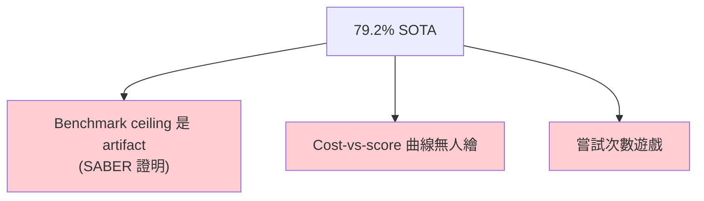
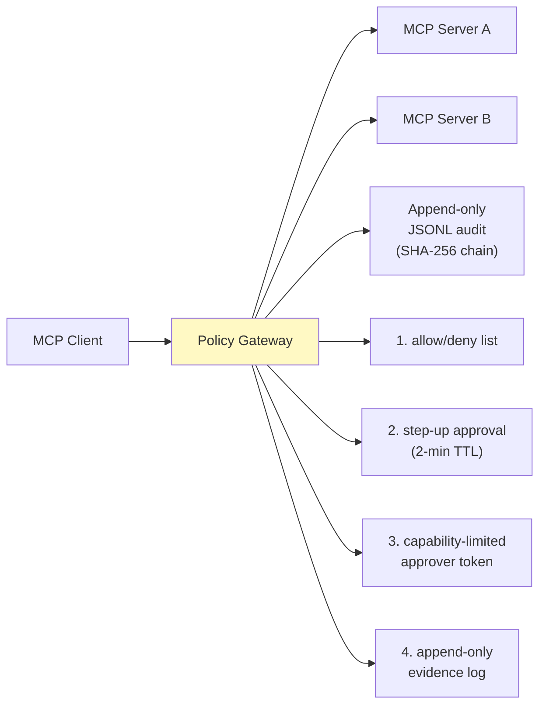
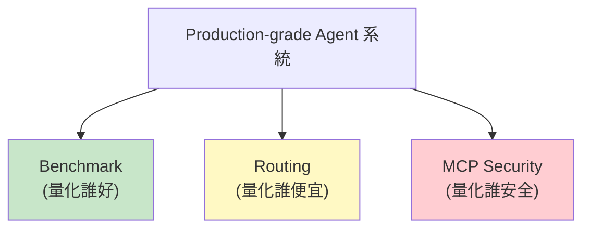
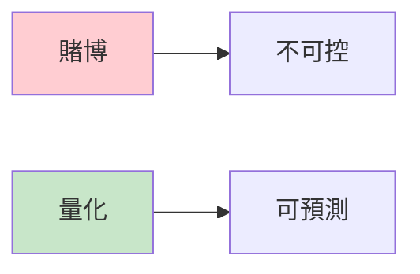

> **type="info" title="為什麼學這個？"**

>
**你在 production agent 系統？** 這章**必讀**。

**3 個核心問題**：誰好？誰便宜？誰安全？這章用 3 個 sub-topic 全回答。
{{< /callout**

>

# M8 — 誰好？誰便宜？誰安全？

> 三個表面獨立、主題內在高度相關的題目。
> Benchmark 量化「誰好」、Routing 量化「誰便宜」、MCP 量化「誰安全」。

---


#### 
**開頭：Production-grade agent 系統的三大支柱**


跑 production agent 系統要回答三個問題：

| 問題 | 解方 |
|------|------|
| 誰**比較好**？ | Benchmark |
| 誰**比較便宜**？ | Routing |
| 誰**比較安全**？ | MCP Security |

這三個主題表面獨立，**內在高度相關** — 都是「把『不確定性』量化」的問題。

---

# Part 1: Benchmark — 量化「誰好」


#### 
**SWE-bench 2026 現狀**


2026 leaderboard 頭部已達 **79.2%**（Claude Opus 4.5 + live-SWE-agent），看似接近「解決」。
但有三個深層問題：



| 問題 | 細節 |
|------|------|
| **Benchmark ceiling 是 artifact** | SABER 論文證明 |
| **Cost-vs-score 曲線無人繪** | leaderboard 只列分數不看成本 |
| **「嘗試次數」遊戲** | single-attack vs multi-attack 比較是 apples-to-oranges |


#### 
**SWE-bench 家族（2026 變體）**


```
SWE-bench 家族
├── Verified（500 題，人工驗證可解）— 主流
├── Lite（300 題，輕量版）
├── Multilingual（9 種程式語言，2026 新增）
├── Multimodal（截圖 + 文字，2025-07 發表）
├── Bash-only（僅 shell 工具，2026 新增）— 強迫「最簡 harness」
└── Test split（500 題私有，需 sb-cli 提交）
```

### 關鍵發現：mini-SWE-agent

**原始 SWE-agent 100+ 行複雜 prompting → mini 版本 100 行 Python code**，靠 Claude Opus 4.5 high reasoning 達到 79.2%。

**這暗示**：

> harness 複雜度對 SOTA 的邊際貢獻正在趨近於零，底層 model 能力是主因。


#### 
**SABER 三大組件 ⭐**


SABER（**S**afeguarding Mutating **A**ctions, **B**lock-based filtering, **E**nhanced **R**eflection）
**不是新 framework，而是 plug-in 層包在現有 agent loop 外**。gradient-free、model-agnostic。

### (A) Mutation-gated human verification

只在 candidate action 是 mutating 時要求 user 確認。Non-mutating action 完全不打擾。

- **mutating 只佔 14-18% 步數** → user 被打擾的頻率約每 6 個 turn 一次
- 把 tool call 改寫成自然語言摘要 + 必要前置條件

### (B) Targeted reflection

在 mutating action 前注入蒸餾後的 constraints 摘要到 `<think>` block。

**這解「lost-in-the-middle」問題**：long context 後 agent 開始忘記 system policy。

### (C) Block-based context cleaning

把 trajectory 切成 block，存 `(s_k, e_k)` 摘要嵌入，**只 retrieve top-N 最相關的 block**。

**這解「context poisoning」**：user 確認記錄塞爆對話歷史後，後面的判斷開始 reference 過期的 confirmation。

### 實驗結果

| Benchmark | Model | No-SABER | +SABER | Δ |
|-----------|-------|----------|--------|---|
| τ-Bench Airline | Qwen3-Thinking-235B | 49.3% | 63.3% | **+14.0 pp** |
| τ-Bench-V Air | Qwen3-Thinking-235B | 58.5% | **78.2%** | **+19.7 pp** |
| τ-Bench Airline | Claude Sonnet 4 | 62.6% | **76.5%** | **+13.9 pp** |

**Ablation 證明三者非線性疊加** — Full SABER +20.7 pp，遠超任一單獨效果。


#### 
**Benchmark 設計的典範轉移**


> 從「分數高」到「評分可靠」

- **τ-Bench Verified** — 當 agent 在原始 τ-Bench 上分數飽和，**先懷疑 benchmark 本身**
- SABER 團隊手動審計 165 題、修正 ground truth、擴寫 user instruction 釋出 Verified 版本
- **但其他 benchmark（GAIA、HotpotQA、ToolBench）沒人做** — 未來 12 個月可能會看到一波 Verified 版本發布

---

# Part 2: Routing — 量化「誰便宜」


#### 
**為什麼需要 Routing**


- **Token 成本爆炸**：每個 agent 流程 5-20 次 LLM call，複雜任務 50-500k tokens
- **任務異質**：同一個 agent 同時做「格式化訊息」、「RAG 摘要」、「規劃工具呼叫鏈」三種本質不同的工作
- **全部用 frontier model 是嚴重的資源浪費**


#### 
**三種基本 Routing 策略**


### (A) Static Tiered Routing（最簡單）

```python
TIER_TABLE = {
    "summarize":  "anthropic/claude-haiku-4-5",
    "extract":    "openai/gpt-4.1-mini",
    "plan":       "openai/gpt-5.2",
    "code":       "x-ai/grok-code-fast-1",
    "reflect":    "anthropic/claude-sonnet-4.5",
}
```

### (B) Cascading / Self-Cascade（最普遍）

```python
def cascade(prompt, budget):
    cheap_response, cheap_conf = call("haiku-4.5", prompt, return_logprob=True)
    if cheap_conf > 0.92 or budget.exhausted:
        return cheap_response
    return call("claude-sonnet-4.5", prompt, verify(cheap_response))
```

### (C) Learned Router（最 SOTA）

用小 router model（often distilled 1B param）把每個 prompt 對應到 1-of-N models，訓練資料來自大規模 human/AI 偏好對齊。


#### 
**OpenRouter 2026 Primitives**


| Variant | 機制 | 成本 | 適用 |
|---------|------|------|------|
| `:floor` | 永遠選最便宜的能完成任務的 model | 最低 | 開發/批次 |
| `:nitro` | 永遠選延遲最低的（通常 = 最便宜的）| 中 | 互動式 |
| `:free` | 免費 model，20 RPM/50-1000 RPD 限制 | $0 | 開發/低成本 agent |
| `:auto` | ML router 學出來的「每分錢最高品質」 | +5-10% 溢價 | **生產環境預設** |


#### 
**關鍵洞見**


- **Agentic cost curve 從線性變次線性** — 20-step flow 從「20 × frontier」變「5 × frontier + 15 × mini」，**60-75% 成本下降**（Not Diamond 公開 case studies）
- **可靠性提升，不是下降** — 早期擔心 routing 會引入不一致；2026 數據顯示 routing 系統的 *aggregate* reliability 反而高於單一 frontier


#### 
**關鍵警告**


> **沒有 verifier 就不要做 cascade**

「cheap model 自信錯了」是最危險的 — 它會把 hallucination 包裝成 high confidence，**比直接用 frontier 更難 debug**。


#### 
**可複製性**


✅ **可以自己做**：
- Static tiered + heuristic — 50 行 Python
- Cascade with self-verifier — 200 行 Python
- 用 OpenAI/Anthropic SDK 切換 — 不用 OpenRouter

❌ **自己做不了的**：
- ML router 的 training data（需要百萬級 human preference label）
- 400+ model 的 capability benchmarking
- 即時 model availability / pricing / latency 監控

**瓶頸是訓練資料，不是演算法**。

---

# Part 3: MCP Security — 量化「誰安全」


#### 
**2026 範式轉移**


> **MCP 從「tool bus」變成「policy-enforced tool fabric」是 2026 年最大範式轉移**

- Tool list 不再是「我能接什麼」而是「我**應該**讓 LLM 看到什麼」
- 每個 host（Claude Desktop、Cursor、Cline、Windsurf）的預設行為是「LLM 看得到 = LLM 能 call」 — **這是根本錯誤**


#### 
**三層防禦模型**


| 層 | 攔截點 | 代表實作 | 防什麼 |
|----|--------|---------|--------|
| **L1 Tool-list filter** | client 看到 tools 之前 | mcp-routing-gateway, Epydios | 危險 tool 不給 LLM 看、virtualize 替換 |
| **L2 Call-time policy** | tool 執行前 | Epydios (allow/deny + step-up approval) | 需要 user 在場同意的 destructive ops |
| **L3 Output sanitizer** | tool 結果回給 LLM 前 | StackOneHQ/defender | indirect prompt injection |
| **L0 Registry/Discovery** | 載入 MCP server 時 | mcp-contextprotocol/registry, agentseal | 防止裝到已知惡意 server |


#### 
**StackOne Defender — Output Sanitizer 設計**


**最值得抄的 output sanitizer 設計**：

```typescript
import { createPromptDefense } from '@stackone/defender';

const defense = createPromptDefense({ blockHighRisk: true });
const result = await defense.defendToolResult(toolOutput, 'gmail_get_message');

if (!result.allowed) {
    // Tier 1: 規則 pattern (Unicode tag, Base64, BiDi override, zero-width)
    // Tier 2: ONNX classifier (22MB, ~10ms latency, F1 90.8%)
    throw new Error('Tool output blocked by Defender');
}
```

**為什麼這個設計重要**：
- **CPU only**、**~10ms latency**、**22MB model** — 真的能塞進 agent loop
- 兩層：規則擋 90% 已知攻擊快又便宜，ML 補 10% 變體
- `blockHighRisk: true` 是 **fail-closed 預設**（反向於大多數 LLM library 的 fail-open）


#### 
**Epydios Policy Gateway**


**最完整的 policy engine 雛型**：



**關鍵 primitives**：
- **Step-up approval** — 高風險 tool 必須 user 透過 CLI `aimxs-cli approve <id>` 才能執行
- **Separation of duties** — approver token 跟 executor token 是不同 capability，**自己不能 approve 自己的 call**
- **Append-only JSONL audit** — 每一次 tool call 都有 SHA-256 chain 串接


#### 
**根本未解問題**


> 「LLM 看到 tools = LLM 執行」這個根本問題沒人解

所有 L1 filter 都是「別讓 LLM 看到」，但這跟 LLM 本身能 infer 出工具存在的能力衝突。
例如「刪除檔案」的 tool 被 filter 掉，但 user 問「能刪檔嗎」LLM 還是會在 description 之外找到其他寫檔路徑（shell.exec、fs.write）。

**真正的解法是 capability-based security**：tool 本身要有 **unforgeable capability token**，LLM「看到」≠「擁有 capability」。


#### 
**限制**


{{< details title="⚠️ 限制與評估（點開看誠實檢討）"**

>
- **Defender F1 90.8% 在 adversarial 設定下可能掉到 70% 以下** — 任何 ML classifier 面對 adaptive attacker 都會掉
- **多層防禦的代價是延遲堆疊** — Defender 10ms + Policy gateway 5ms + Registry scan 200ms + Audit log 5ms = ~220ms per tool call
- **2026 學術圈落後實作 6-12 個月** — 找不到一篇 2026 arXiv 專門針對 MCP 攻擊面
- **Registry 是新的 supply chain 風險** — 跟 X.509 PKI 早期 CA 信任問題同構

---


{{< /details**

>


#### 
**三主題交叉：Production-grade Agent 系統的標配**




```
[Benchmark]    →  量化「誰好」  →  internal benchmark + leaderboard 對比
[Routing]      →  量化「誰便宜」 →  cheap-first cascade + cost circuit breaker
[MCP Security] →  量化「誰安全」 →  policy gateway + output sanitizer + audit log
```

---


#### 
**給我的啟示**


{{< details title="💡 給實作者的啟示（點開看 actionable 建議）"**

>
### Benchmark 方向

| 方向 | 難度 | 具體 |
|------|------|------|
| **建立 firn 自己的 SWE-bench Verified 子集** | 🟡 Moderate | 從現有 research script 手動審計 20 個 ground truth |
| **評估 cost-vs-score Pareto** | 🟡 Moderate | 在 Lite 50 題上跑多個模型，輸出 Pareto frontier plot |
| **SABER-style action risk classifier** | 🟡 Moderate | 在 agent loop 加 mutation 分類 |
| **Block-based context cleaning** | 🟡 Moderate | 對話歷史改 block 結構 |

### Routing 方向

| 方向 | 難度 | 具體 |
|------|------|------|
| **Static tiered routing** | 🟢 Trivial | 加 `TaskTier` enum + routing table |
| **Cascade wrapper** | 🟡 Moderate | cheap → confidence check → 升級到 frontier |
| **Cost-based circuit breaker** | 🟢 Trivial | 擴充現有 `CircuitBreaker` 加 hourly spend threshold |

### MCP Security 方向

| 優先 | 方向 | 難度 | 具體 |
|------|------|------|------|
| **P0** | L3 Output sanitizer | 🟡 Moderate | 抄 StackOne Defender Tier 1 regex（純 Python 零 ML 依賴）|
| **P1** | L1 Tool-list filter | 🟢 Trivial | `mcp/registry.py` 加 allowlist，預設 deny `fs.write`、`exec`、`send_*` |
| **P1** | Step-up approval 雛形 | 🟡 Moderate | 抄 Epydios 模式，destructive tool 預設需要 confirmation |
| **P2** | JSONL audit log | 🟢 Trivial | 加 `MCP_CALL_SPAN`，記錄 (server, tool, args_hash, decision) |

---


{{< /details**

>


#### 
**結語：把不確定性量化**


我從這章學到一件事：

> **Production-grade agent 系統的標配 = 把三個不確定性量化**
>
> 誰好 → 用 benchmark
> 誰便宜 → 用 routing
> 誰安全 → 用 MCP security

**沒有這三層量化，就是在賭博**。



---


## Q&A — 給實作者的常見問題

{{< details title="Q1: 為什麼 SWE-bench 79.2% 不算解決 agent 問題？"**

>
**SABER 論文證明**：benchmark ceiling 是 artifact，不是 model ceiling。

**三個深層問題**：

1. **Benchmark ceiling 是 artifact**（用 Verified 修正後分數會掉）
2. **Cost-vs-score 曲線無人繪**（leaderboard 只列分數不看成本）
3. **「嘗試次數」遊戲**（single-attack vs multi-attack 是 apples-to-oranges）
{{< /details**

>

{{< details title="Q2: 沒有 verifier 就不要做 cascade 對嗎？"**

>
**對，這是 2026 routing 最重要的警告**。

**為什麼**：cheap model「自信錯了」是最危險的 — 它把 hallucination 包裝成 high confidence，**比直接用 frontier 更難 debug**。

**自做 cascade 必要條件**：self-verifier（cheap model 也回 confidence）。
{{< /details**

>

{{< details title="Q3: MCP 從 tool bus 變 policy-enforced tool fabric 是什麼意思？"**

>
**範式轉移**：

- 以前：「我能接什麼」=「tool list」
- 現在：「我**應該**讓 LLM 看到什麼」=「policy gate」

**3 層防禦**：

1. **L1 Tool-list filter** — 危險 tool 不給 LLM 看
2. **L2 Call-time policy** — 高風險 tool 需使用者確認
3. **L3 Output sanitizer** — 防 indirect prompt injection
{{< /details**

>

---

## 給實作者的 checklist

> 評估你的 **M8-BENCHMARKS** 系統是否 production-grade：

- [ ] 有對應的設計元素實作
- [ ] 失敗模式有被識別
- [ ] 可量化的評估指標
- [ ] 跨來源的設計 pattern 驗證
- [ ] 邊界情況有處理

---

## 下一步學什麼

回到學習路徑，看下一步方向

→ [繼續 →](/learning-path/)

## 引用與延伸閱讀

{{< details title="📚 引用與延伸閱讀（點開看完整 reference）"**

>
**原始整合文**：
- [benchmark-routing-mcp-core-concepts.md](https://github.com/example/obsidian-vault/blob/main/research/agent/benchmark-routing-mcp-core-concepts.md)

**原始研究報告**：
- 2026-06-04: swe-bench-2026-leaderboard 與 agent benchmark 設計反思
- 2026-06-05: llm-model-routing-cascade-cost-economics-for-ai-agents-2026
- 2026-06-06: mcp-ecosystem-maturity-2026

**關鍵專案**：
- SWE-bench leaderboard
- SABER paper
- OpenRouter
- StackOneHQ/defender
- Epydios-MCP-Policy-Gateway
- modelcontextprotocol/registry

**相關 M 主題**：
- [M2 Multi-Agent](/docs/m2-multi-agent/) — MCP 是多 agent 的工具標準
- [M5 Meta-Agent](/docs/m5-meta-agent/) — policy engine 是 meta-agent 的執行工具
- [M6 Code vs Tool](/docs/m6-code-vs-tool/) — MCP tool calling 整合
- [M7 Observability](/docs/m7-observability/) — audit log 是 observability 的一環

{{< /details**

>
