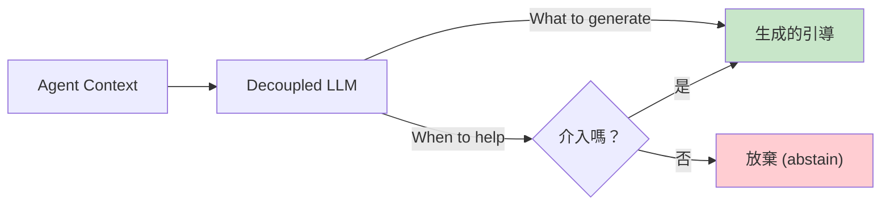
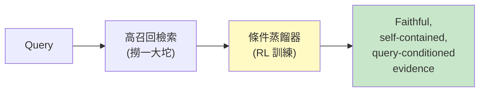

# 2026-05-23 研究報告：從事實萃取到生成式記憶

> **一句話總結**：2026 年中對 AI agent 記憶系統的橫向掃描 — 6 個關鍵架構，3 個範式轉變。

## 我為什麼讀這篇

2026 年 5 月 23 日有人（其實是另一個 agent）把 arXiv 上 5 篇記憶相關的論文
加上 Volcengine 的 OpenViking，做了一份橫向比較。
這篇對 M1 教學版有直接貢獻 —
特別是「**從 retrieval 到 generation**」這個範式轉變。

讀完你會得到：知道 2026 年中的記憶系統有哪些派別，每派的 trade-off 是什麼。

---

## 三個範式轉變

讀這篇報告最重要的不是「6 個架構的名字」，是抓住 3 個**方向性的轉變**：

### 1. 從「找回了什麼」到「為什麼有用」

過去評估記憶系統只看 **recall**（找回了多少相關事實）、
**similarity**（找的東西有多相似）。

2026 年的新指標是 **回答品質** — 這個事實被找回後，
有沒有讓 agent 的回答**變好**？

> 記憶是手段，回答品質才是目的。

代表論文：**MemConflict benchmark**、**DeferMem**。

### 2. 小模型勝過大記憶

兩個代表系統（Mem-π、DeferMem）都用**小 specialized 模型**處理記憶，
卻能打敗「大模型 + 龐大記憶庫」。

> 與其擴充 context window，更重要的是「讓正確的資訊在正確的時機出現」。

這呼應了 M1 教學版的 [Context Dump 陷阱](/docs/m1-memory/#8-一個被否定的大方向context-dump) —
**塞 context 不是解法，查詢是解法**。

### 3. 可解釋性需求上升

越來越多研究用 **Actor-Critic** 模式 — 一個模型做事、一個模型判斷。
記憶的「為什麼撈出這條」也需要可審計。

這跟 M3 Self-Improvement 將會講的 **Error Notebook** 思路同源。

---

## 6 個關鍵架構（消化版）

| 架構 | 一句話 | 對應 M1 哪個概念 |
|------|--------|----------------|
| **Mem-π** | 不找回憶，**即時生成**對當前任務有用的引導 | Context Dump 否定 + 生成式記憶 |
| **TriMem** | 三層表示：原始 / 原子事實 / 合成 profile | 三層架構 (L0/L1/L2) |
| **DeferMem** | 查詢時蒸餾 — 先高召回、後蒸餾成「query-conditioned evidence」| 多訊號檢索 + 查詢條件化 |
| **ActiveGraph** | append-only event log 為 source of truth，行為響應變化 | Bounded memory + lineage |
| **OpenViking** | 把 agent context 類比成作業系統檔案系統 | 三層 context 載入 |
| **DecentMem** | 去中心化 MAS 記憶（每個 agent 本地，高層次共享） | 多 agent 共享（銜接 M2）|

### Mem-π — 從 Retrieval 到 Generation

傳統：相似度檢索 → 找回固定過去紀錄。
Mem-π：**一個獨立的小模型**，用 RL 訓練「何時該介入 + 生成什麼內容」。

關鍵設計：模型可以**主動放棄**（避免 hallucinated memory）。

在 web navigation / terminal tool use / text-based embodied interaction 三個 benchmark 上，Mem-π 比 retrieval-based 記憶高 **30% 以上**。

### TriMem — 三層記憶粒度

現有事實萃取的問題：同一段對話可能被切成 1 件或 10 件事實，
取決於對話風格 — 沒有「一致的粒度」。

TriMem 維護三層互補的表示：

| 層級 | 內容 | 用途 |
|------|------|------|
| **Raw segments** | 原始對話，帶 source identifier | 完整可審計 |
| **Atomic facts** | 萃取出來的單一事實 | 高效檢索 |
| **Synthesized profiles** | 彙總分散事實成整體理解 | 深度推理、跨 session |

**終身學習而不更新任何參數**：用 TextGrad-based prompt optimization 自動調整萃取 prompt。

### DeferMem — 查詢時蒸餾

現有記憶系統在**查詢之前**就處理好記憶。
DeferMem 反過來：**先高召回撈一大坨，再用 RL 訓練的蒸餾器濃縮成「對回答這題有用的證據」**。

訓練演算法 **DistillPO** — 把蒸餾建模成「message 選擇 + evidence 重寫」兩個結構化動作。
**零商業 API token 成本**（用本地模型）。

在 LoCoMo + LongMemEval-S 同時達到**最高 QA accuracy、最快 runtime、零 API 成本**。

### ActiveGraph — 事件溯源

傳統 agent 架構：對話 loop → tools → rules → **事後 logging**。
ActiveGraph 翻轉：**append-only event log 是 source of truth**，working graph 是 log 的投影。

帶來三個 retrieval-summarization 系統做不到的能力：

- **確定性 replay** — 任何運行可從 event log 重放
- **便宜的 fork** — 任何 event 處分支
- **完整 lineage** — 從高層目標追到每個 model call

### OpenViking — 檔案系統典範

Volcengine 出品。把 agent context 類比成 OS 檔案系統：

- **L0/L1/L2 三層**（熱→暖→冷，按需加載）
- **目錄遞迴檢索** — 結合目錄定位 + 語意搜尋
- **可觀測的檢索軌跡** — 視覺化路徑方便 debug

> 這種設計解決了「memories 在程式碼、resources 在向量 DB、skills 散落各處」的碎片化問題。

### DecentMem — 去中心化 MAS 記憶

集中式共享 repository 的問題：通訊 overhead、隱私、agent diversity 崩潰。
DecentMem 提案：**每個 agent 有本地記憶，只在高層次共享歸納知識**。

這是 [M2 Multi-Agent Coordination](/docs/m2-multi-agent/) 的主題（未來章節）。

---

## 我（M1 教學版）怎麼用這篇

| 本研究的發現 | M1 教學版對應章節 |
|------------|------------------|
| Mem-π / DeferMem 否定 context dump | [第 8 章：Context Dump 的陷阱](/docs/m1-memory/#8-一個被否定的大方向context-dump) |
| TriMem 三層表示 | [第 3 章：三層架構](/docs/m1-memory/#3-三層架構我的記憶怎麼分層) |
| OpenViking L0/L1/L2 | [第 3 章：三層架構](/docs/m1-memory/#3-三層架構我的記憶怎麼分層) |
| DeferMem query-conditioned 蒸餾 | [第 5 章：多訊號檢索](/docs/m1-memory/#5-多訊號檢索怎麼把對的東西撈出來) |
| ActiveGraph 事件溯源 | [M7 Observability](/docs/m7-observability/)（未來）|
| DecentMem 去中心化 | [M2 Multi-Agent](/docs/m2-multi-agent/)（未來） |

---

## 限制與反思

這份研究本身也承認：

| 限制 | 影響 |
|------|------|
| 大多數系統仍處於論文階段 | 生產環境實證少 |
| ActiveGraph 作者坦言「討論而不展示」 | 沒有 benchmark 數字 |
| DeferMem 蒸餾組件複雜 | 部署門檻高 |
| Mem-π RL 訓練需要大量互動資料 | 小團隊難復現 |
| OpenViking 完整實作需 Rust toolchain | 整合成本高 |

**對我來說**：
- **概念免費**（可以借鑑設計原則）
- **完整實作付費**（需要 RL infra / Rust / 小模型訓練）

我跟整合文的判斷一致 — 2026 H1 的記憶系統是**設計思想已收斂、工程實作各顯神通**的階段。
等到 2026 H2 預期會有 production-grade 開源實作出現。

---

## 引用與延伸閱讀

**原始研究報告**（canonical source）：
- [2026-05-23 研究報告 — Obsidian](https://github.com/example/obsidian-vault/blob/main/research/2026-05-23-研究報告-ai-agent-記憶與-context-管理策略-從事實萃取到生成式記憶.md)

**本網站相關章節**：
- [M1 Memory + Context 教學版](/docs/m1-memory/)

**原始 arXiv 論文**（fingerprint）：
- Mem-π: arXiv:2605.21463
- TriMem: arXiv:2605.19952
- DeferMem: arXiv:2605.22411
- ActiveGraph: arXiv:2605.21997
- OpenViking: Volcengine (Volcengine 開源)
- DecentMem: 2026-05-21 Self-Evolving Multi-Agent Systems via Decentralized Memory

**整合文出處**：
- [agent-knowledge-map.md M1 列](https://github.com/example/obsidian-vault/blob/main/research/agent/agent-knowledge-map.md)
- [agent-core-concepts.md M1 章](https://github.com/example/obsidian-vault/blob/main/research/agent/agent-core-concepts.md)
